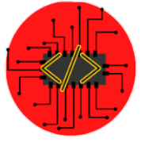

# **InstaDev**
## Este projeto mostra como fica a pagina inicial, de um possível rede social futuramente. Ela é destinada mas para os desenvolvedores de todas as idades e todas as linguagens e frameworks do mundo.
## Esse projeto foi criado para ajudar os desenvolvedores a fazer posts de seus projeto em uma rede social que muitos outros pessoas vai poder ver a sua página com facilidade e podendo encontrar contribuidores com novas ideias para seus projetos, e principalmente fazer seus projetos correr o mundo, podendo ser encontrado por empresas que queiram comprar às suas ideias.

# Tecnologias Usadas

# Características
- ## Publicar projetos.
- ## Achar mais comunidades de programadores.
- ## Poder usar seu nome que está no GitHub para fazer login e uma senha.
- ## Acompanhar novos programas e criações tecnologicas feita por todo o mundo.
- ## Pode ser usado no pc ou no celular

# Fotos das página inicial do InstaDev

## Versão para Desktop:

## Versão para Celular:

# Curiosidades:
## Embreve vou está atualizando esse app, agora é so a página inicial, mas daqui a pouco vou está colocando funções em cada botão e adicionando mas tecnologias nele, como o javacript ou até tentando colocar python para fazer algumas funções dentro dele.

# Links e contatos:
## GitHub: https://github.com/Isaac-Fernandes
## Repositório: https://github.com/Isaac-Fernandes/InstaDev
## E-mail: fernandes_isaac100@hotmail.com
## Instagram: https://www.instagram.com/isaac_fernandes1309/
## Site: http://127.0.0.1:5500/index.html#

# Autor:
- ## Isaac Fernandes dos Santos
